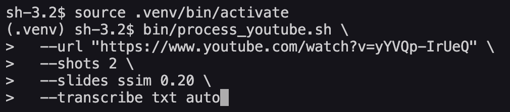
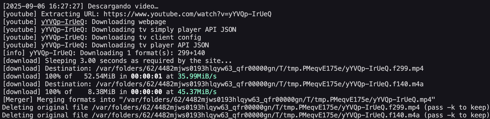
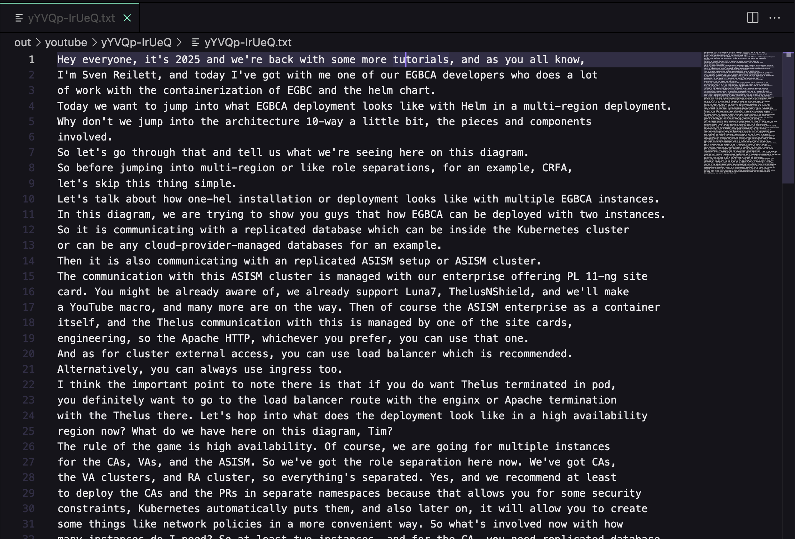

# VideoToolkit — Guía de uso

**VideoToolkit** es una colección de scripts en bash y Python diseñada para facilitar el procesamiento de videos grabados con OBS (`.mkv`) o provenientes de **YouTube**.  A partir de un archivo de entrada puedes extraer audio en alta calidad, generar capturas periódicas, filtrar esas capturas para quedarte solo con las diapositivas relevantes, crear clips acelerados y hasta transcribir el audio a texto en varios formatos.  Todo ello se apoya en herramientas consolidadas como **ffmpeg/ffprobe**, **yt‑dlp** y **faster‑whisper**.

Este documento está pensado para orientarte paso a paso, comenzando por la creación del entorno de trabajo y culminando con un ejemplo práctico usando un video real de YouTube.

## Ejemplo rápido: del entorno virtual a los slides y la transcripción

Para demostrar el flujo completo, a continuación verás cómo configurar el entorno, descargar un video de YouTube, generar capturas filtradas (slides) y obtener la transcripción en texto plano.  Tomaremos como ejemplo este video de YouTube:

> https://www.youtube.com/watch?v=yYVQp-IrUeQ

### 1. Preparar el entorno Python (virtual environment)

En Linux o macOS abre una terminal, ubícate en el directorio del proyecto y crea un entorno virtual para aislar dependencias.  Luego instala los requisitos del archivo `requirements.txt`:

```bash
# crear y activar el venv
python3 -m venv .venv
source .venv/bin/activate
# actualizar pip e instalar dependencias
python -m pip install --upgrade pip
pip install -r requirements.txt
```

En Windows con PowerShell el procedimiento es similar:

```powershell
py -3 -m venv .venv
\.venv\Scripts\Activate.ps1
python -m pip install --upgrade pip
pip install -r requirements.txt
```

> Asegúrate también de tener **ffmpeg** y **ffprobe** disponibles en tu `PATH`.  Si planeas descargar videos de YouTube, instala **yt‑dlp** (`pip install yt‑dlp`) o usa Homebrew en macOS.

### 2. Procesar el video de YouTube y extraer slides y transcripción

Con el entorno listo, ejecuta el script `process_youtube.sh` con la URL del video, el modo `--shots 2` para realizar capturas cada 2 segundos y añade `--slides` y `--transcribe` para obtener diapositivas filtradas y la transcripción.  En este ejemplo utilizamos el método (`ssim`) con un umbral de 0.20 para seleccionar las diapositivas y solicitamos la transcripción en formato `txt` en idioma inglés (`en`):

```bash
bin/process_youtube.sh \
  --url "https://www.youtube.com/watch?v=yYVQp-IrUeQ" \
  --shots 1 \
  --slides ssim 0.20 \
  --audio \
  --transcribe txt en
```

Lo que hace este comando es:

1. **Descargar** el mejor MP4 disponible de la URL proporcionada mediante `yt‑dlp`.
2. **Extraer el audio** a MP3 de 320 kbps.
3. **Generar capturas** periódicas del video (por defecto cada 5 segundos).
4. **Filtrar** esas capturas para quedarse solo con las diapositivas significativas usando el método `phash` y el umbral indicado.
5. **Crear un clip acelerado** de todo el video (velocidad 2x por defecto).  Esta parte puede omitirse si no es necesaria, prescindiendo de la opción `--all` y seleccionando manualmente las funciones que te interesen.
6. **Transcribir** el audio a texto usando faster‑whisper.  El argumento `txt` define el formato de salida y `es` indica que el idioma de destino es español.  Puedes reemplazar `es` por `auto` para autodetección o por códigos como `en`, `fr`, etc.

Tras la ejecución se creará una carpeta de salida dentro de `out/youtube/` con el ID del video (`yYVQp-IrUeQ`).  Allí encontrarás archivos como:

- `*.mp3` – el audio extraído.
- `shots/shot-0001.jpg` – capturas brutas tomadas cada pocos segundos.
- `slides/slide-0001.jpg` – diapositivas filtradas según el método y umbral elegidos.
- `*.speed2.0.mp4` – clip acelerado (si `--all` está activado).
- `*.txt` – transcripción en texto plano.  Otros formatos disponibles son `srt`, `vtt` y `json`.

Puedes ajustar el método de filtrado de diapositivas (`phash`, `ssim` o `hist`) y el umbral para adaptarte mejor al contenido de tus videos.  Consulta la sección “Selección de diapositivas clave” más abajo para orientarte.

### 3. Verifica los resultados

Una vez completado el proceso, navega al directorio de salida (`out/youtube/yYVQp-IrUeQ`) y explora los archivos generados.  Aquí puedes abrir las imágenes de las diapositivas, reproducir el clip acelerado o leer la transcripción.







---

## Capacidades del toolkit

- **Extracción de audio (MP3):** crea un archivo `.mp3` de alta calidad a partir del video.
- **Capturas periódicas (shots):** guarda imágenes cada `N` segundos (`--shots N`) o a una tasa determinada en fotogramas por segundo (`--fps`).
- **Selección de diapositivas clave:** usa métodos como `phash`, `ssim` o `hist` para filtrar las capturas y quedarte solo con las diapositivas relevantes (`--slides método umbral`).
- **Clips acelerados:** genera un video acelerado a 2x, 4x, etc., de todo el archivo o de un segmento (`--clip inicio fin velocidad`).
- **Transcripción de audio:** convierte el audio a texto en formatos `txt`, `srt`, `vtt` o `json` y soporta varios idiomas (`--transcribe formato idioma`).

Todas estas funciones pueden combinarse libremente en los scripts `process_mkv.sh` (para archivos locales `.mkv`) y `process_youtube.sh` (para URLs de YouTube).

## Requisitos y dependencias

1. **ffmpeg** y **ffprobe** en el `PATH`.  Puedes instalarlos mediante el paquete `ffmpeg` en Linux, Homebrew (`brew install ffmpeg`) en macOS o descargando los builds de Windows y agregando la carpeta `bin` a tu `PATH`.  Alternativamente utiliza **WSL** o Git Bash en Windows.
2. **Python 3** con las librerías listadas en `requirements.txt`.  Incluye `yt‑dlp` para descargar videos de YouTube y `faster‑whisper` para transcribir audio.
3. **bash** (disponible por defecto en Linux/macOS y en WSL para Windows).  Para usar únicamente ffmpeg y prescindir de los scripts puedes consultar las líneas de ejemplo en la sección de Windows más abajo.

## Estructura del proyecto

La organización interna sigue un diseño modular:

```
VideoToolkit/
├─ bin/
│  ├─ process_mkv.sh         # Procesa archivos .mkv
│  ├─ process_youtube.sh     # Procesa URLs de YouTube
│  └─ transcribe.sh          # Transcribe audios existentes
├─ python/
│  ├─ transcribe_audio.py    # Utilidad Python para transcribir sin bash
│  └─ select_slides.py       # Lógica de filtrado con OpenCV
├─ lib/
│  └─ common.sh              # Funciones reutilizables (audio, capturas, clips)
├─ out/                      # Carpeta donde se guardan las salidas
├─ requirements.txt          # Dependencias Python
└─ README.md                 # Esta guía
```

El directorio `out/` se crea dinámicamente.  Allí encontrarás una subcarpeta para cada video procesado.  El nombre de la subcarpeta coincide con el nombre del archivo de entrada (para `.mkv`) o con el ID del video de YouTube.

## Uso general de los scripts

### Procesar un archivo MKV

Para procesar una grabación local en `.mkv` utiliza `process_mkv.sh`.  Algunos ejemplos:

```bash
# Ejecutar todo (audio, capturas, clip)
bin/process_mkv.sh --in clase.mkv --all

# Solo extraer audio
bin/process_mkv.sh --in clase.mkv --audio

# Capturas cada 3 segundos
bin/process_mkv.sh --in clase.mkv --shots 3

# Clip acelerado de 1:00 a 5:00 a 2.5x
bin/process_mkv.sh --in clase.mkv --clip 00:01:00 00:05:00 2.5

# Filtro de diapositivas tras capturar
bin/process_mkv.sh --in clase.mkv --shots 5 --slides phash 12

# Transcripción integrada
bin/process_mkv.sh --in clase.mkv --audio --transcribe srt es
```

### Procesar una URL de YouTube

El flujo para YouTube es idéntico al de archivos locales, con la diferencia de que primero se descarga el video.  Los parámetros disponibles son los mismos.  Ejemplos:

```bash
# Descarga y ejecuta todo
bin/process_youtube.sh --url "https://www.youtube.com/watch?v=abc" --all

# Solo audio y transcripción en inglés
bin/process_youtube.sh --url "https://www.youtube.com/watch?v=abc" --audio --transcribe txt en

# Capturas filtradas con SSIM y umbral 0.20
bin/process_youtube.sh --url "https://www.youtube.com/watch?v=abc" --shots 5 --slides ssim 0.20
```

### Selección de diapositivas clave

Al capturar imágenes cada pocos segundos suele haber muchas casi idénticas.  Para quedarte solo con las diapositivas que presentan contenido nuevo se usan tres métodos:

* **phash**: usa un hash perceptual (distancia de Hamming 0–64).  Umbrales recomendados de 8 a 16; valores más altos exigen diferencias mayores.
* **ssim**: mide la similitud estructural (0–1).  Utiliza `1‑SSIM` como métrica; umbrales de 0.10 a 0.25 funcionan bien en presentaciones con transiciones suaves.
* **hist**: correlación de histograma (0–1); también usa `1‑corr`.  Se sugieren umbrales de 0.20 a 0.40.

Puedes ajustar estos parámetros desde `process_mkv.sh` o `process_youtube.sh` con la opción `--slides <método> <umbral>`.  Si quieres ejecutar la selección aparte sobre capturas ya generadas, usa el script Python:

```bash
python python/select_slides.py \
  --in out/clase/shots \
  --outdir out/clase/slides \
  --method phash \
  --threshold 12
```

La opción avanzada `--min-gap N` ignora los siguientes `N‑1` fotogramas tras una imagen seleccionada, evitando ráfagas de diapositivas muy próximas.

## Transcripción de audio a texto

La transcripción se realiza con **faster‑whisper**, que soporta modelos multilingües.  Puedes integrarla en el flujo con `--transcribe` o ejecutarla de forma independiente:

```bash
# Transcribir un MP3 existente a SRT en español
bin/transcribe.sh --in out/clase/clase.mp3 --format srt --lang es

# Uso directo del script Python para mayor flexibilidad
python python/transcribe_audio.py --in out/clase/clase.mp3 --format json --lang es --outdir out/clase
```

Los formatos disponibles son:

- **txt:** texto plano (sin marcas de tiempo).
- **srt:** subtítulos en formato SubRip con marcas `HH:MM:SS,mmm`.
- **vtt:** subtítulos WebVTT.
- **json:** incluye idioma detectado, duración total y segmentos `{start,end,text}`.

Para audios largos en CPU se recomienda usar modelos `tiny` o `base` para mayor velocidad (`FWHISPER_MODEL=tiny`).  Con GPU CUDA puedes aprovechar modelos mayores (`small`, `medium`, `large‑v3`) y definir el dispositivo con `FWHISPER_DEVICE=cuda`.

## Notas y consejos

- Si obtienes un error del tipo “command not found: ffmpeg/ffprobe”, instala ffmpeg y asegúrate de que su ruta `bin` esté en la variable `PATH`.
- Para velocidades de clip altas (>2x), la cadena de filtros de audio `atempo` puede distorsionar el sonido; prueba valores entre 2x y 4x para obtener resultados aceptables.
- YouTube puede aplicar limitaciones temporales al descargar.  Si notas que la descarga se detiene, añade `--sleep‑requests 1` a la llamada de `yt‑dlp` en los scripts.
- En Windows puro (sin WSL), puedes replicar las funciones básicas con ffmpeg en PowerShell.  Consulta la sección de Notas técnicas en el README original para ejemplos.